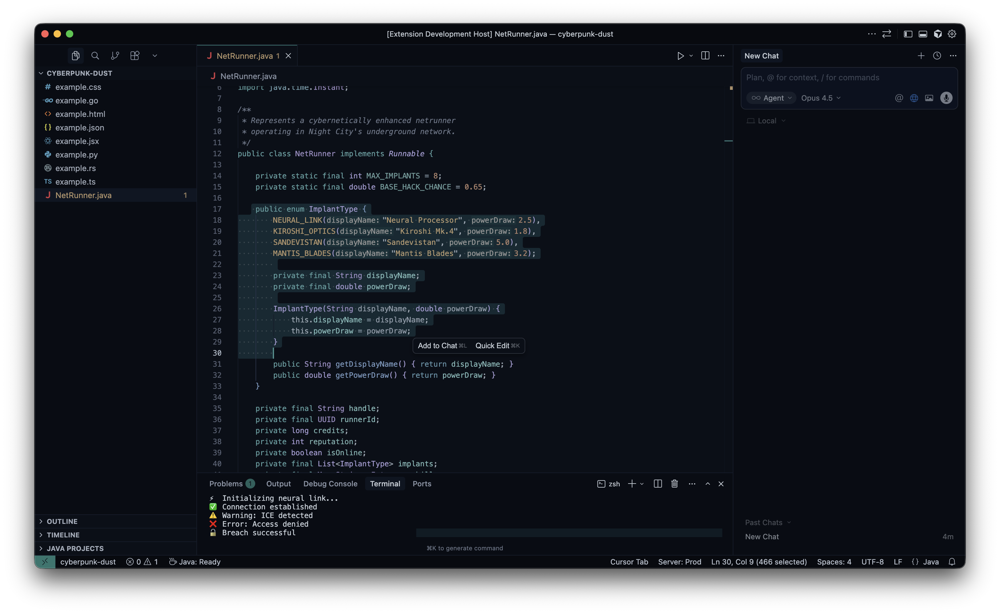

# Cyberpunk Dusk

A cyberpunk-inspired dark theme for Visual Studio Code. Immerse yourself in the neon-lit streets of Night City with vibrant colors against a deep, dark background.



## Features

- 🌆 **Dark, immersive background** - Easy on the eyes during long coding sessions
- ✨ **Vibrant neon accents** - Magenta, cyan, and electric highlights
- 🎨 **Carefully crafted syntax highlighting** - Optimized for readability
- 🖥️ **Full UI theming** - Editor, sidebar, terminal, and more

## Installation

1. Open **Extensions** sidebar in VS Code (`Ctrl+Shift+X` / `Cmd+Shift+X`)
2. Search for `Cyberpunk Dusk`
3. Click **Install**
4. Open **Command Palette** (`Ctrl+Shift+P` / `Cmd+Shift+P`)
5. Select `Preferences: Color Theme` → `Cyberpunk Dusk`

### Manual Installation

```bash
# Clone the repository
git clone https://github.com/BobMakhlin/cyberpunk-dusk-theme.git

# Copy to VS Code extensions folder
# macOS/Linux
cp -r cyberpunk-dusk-theme ~/.vscode/extensions/

# Windows
# Copy to %USERPROFILE%\.vscode\extensions\
```

## Recommended Settings

For the best experience, consider these optional VS Code settings:

```json
{
  "editor.fontFamily": "'JetBrains Mono', 'Fira Code', Consolas, monospace",
  "editor.fontLigatures": true,
  "editor.fontSize": 12,
  "editor.lineHeight": 1.6,
  "editor.cursorBlinking": "smooth",
  "editor.cursorSmoothCaretAnimation": "on"
}
```

## Recommended Fonts

These fonts pair beautifully with Cyberpunk Dusk:

- [JetBrains Mono](https://www.jetbrains.com/lp/mono/)
- [Fira Code](https://github.com/tonsky/FiraCode)
- [Cascadia Code](https://github.com/microsoft/cascadia-code)

## Contributing

Found a bug or have a suggestion? Feel free to:

1. [Open an issue](https://github.com/BobMakhlin/cyberpunk-dusk-theme/issues)
2. Submit a pull request

## License

[MIT License](LICENSE)

---

**Enjoy coding in the neon glow!** 🌃

If you like this theme, consider leaving a ⭐ on [GitHub](https://github.com/BobMakhlin/cyberpunk-dusk-theme) or a review on the [VS Code Marketplace](https://marketplace.visualstudio.com/items?itemName=bobmakhlin.cyberpunk-dusk-theme).
